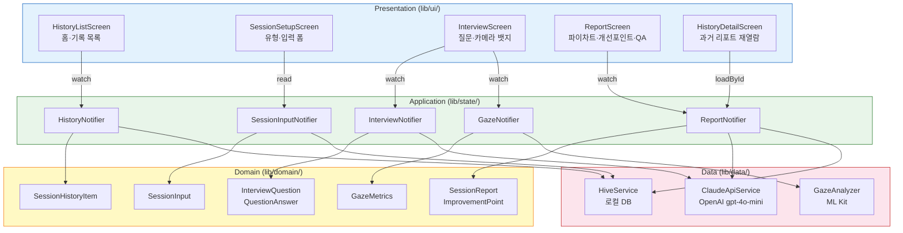

# v-view 아키텍처 문서

---

## 1. 레이어별 책임

| 레이어 | 폴더 | 책임 한 문장 | v-view에서 담당하는 것 |
|---|---|---|---|
| Presentation | `lib/ui/` | 사용자 눈에 보이는 화면과 위젯만 담당한다 | 홈·세션설정·확인·면접·리포트·히스토리 화면 + 공통 위젯 |
| Application | `lib/state/` | 화면과 데이터 사이의 상태·흐름을 조율한다 | 5개 Riverpod StateNotifier (세션입력/면접/시선/리포트/히스토리) |
| Domain | `lib/domain/` | 앱의 핵심 규칙과 데이터 모양을 정의한다 | 5개 Entity (SessionInput·InterviewQuestion·GazeMetrics·SessionReport·SessionHistoryItem) |
| Data | `lib/data/` | 외부 시스템(API·DB·ML Kit)과 실제로 통신한다 | HiveService, ClaudeApiService, GazeAnalyzer, CameraFrameConverter |

---

## 2. 핵심 기능 3개 레이어 흐름

| 기능 | Presentation | Application | Domain | Data |
|---|---|---|---|---|
| AI 질문 생성 | `InterviewScreen`이 질문 카드 표시, 답변 제출 시 꼬리질문 자동 노출 | `InterviewNotifier`가 질문 요청 → 답변 저장 → 꼬리질문 자동 트리거 | `InterviewQuestion` 엔티티 (질문·답변 한 쌍) | `ClaudeApiService`가 Dio로 OpenAI gpt-4o-mini HTTP 호출 |
| 시선 분석 | `InterviewScreen`이 카메라 뱃지(응시율 %) 표시 | `GazeNotifier`가 프레임 수집 + 1000ms 연속 임계값으로 분산 횟수 계산 | `GazeMetrics` 엔티티 (응시율·분산횟수·최대분산시간) | `GazeAnalyzer`(ML Kit FaceDetector), `CameraFrameConverter`(CameraImage→InputImage 변환) |
| 피드백 리포트 | `ReportScreen`이 파이차트 → 개선포인트 TOP3 → Q&A 순서로 렌더링 | `ReportNotifier`가 AI 피드백 요청, 실패 시 시선 지표만으로 fallback | `SessionReport`·`ImprovementPoint` 엔티티 | `ClaudeApiService`(AI 피드백), `ReportLocalDatasource`+`HistoryLocalDatasource`(Hive 저장) |

---

## 3. 디렉토리 트리

```
lib/
├── main.dart                          # 앱 진입점 — Hive 초기화, flutter_dotenv 로드
├── app.dart                           # MaterialApp 정의, 홈 화면 연결
│
├── ui/                                # [Presentation] 사용자에게 보이는 화면·위젯
│   ├── history/
│   │   ├── history_list_screen.dart   # 홈: 세션 기록 목록 + "새 면접 시작" FAB
│   │   └── history_detail_screen.dart # 과거 리포트 읽기 전용 재열람
│   ├── session_setup/
│   │   ├── session_setup_screen.dart  # 면접 유형·직종·회사·자소서 입력 폼
│   │   ├── session_confirm_screen.dart # 입력 확인 + 개인정보 안내
│   │   └── widgets/
│   │       └── interview_type_selector.dart # 직무/인성/대입 선택 칩
│   ├── interview/
│   │   ├── interview_screen.dart      # 질문 카드, 타이머, 카메라 뱃지, 스켈레톤 로딩
│   │   └── widgets/
│   │       ├── question_card.dart     # 질문 텍스트 + 답변 입력 필드
│   │       └── timer_widget.dart      # 세션 경과 시간 표시
│   ├── report/
│   │   ├── report_screen.dart         # 리포트 전체 화면 (생성 → 렌더링)
│   │   └── widgets/
│   │       ├── gaze_metrics_card.dart # 응시율 파이차트 + 지표 수치
│   │       ├── gaze_trend_chart.dart  # 최근 5회 응시율 추이 라인차트
│   │       ├── improvement_list.dart  # 개선 포인트 TOP3 카드
│   │       └── qa_summary_list.dart   # Q&A 요약 목록
│   └── common/
│       ├── camera_permission_screen.dart # 카메라 권한 요청·거부·영구거부 분기
│       └── error_display.dart         # 에러 메시지 공통 위젯
│
├── state/                             # [Application] Riverpod StateNotifier + Provider
│   ├── session_setup/
│   │   └── session_setup_provider.dart  # 세션 입력값 상태 + Hive 자동 저장
│   ├── interview/
│   │   └── interview_provider.dart    # 질문 진행·타이머·꼬리질문 자동 트리거
│   ├── gaze/
│   │   └── gaze_provider.dart         # 카메라 프레임 수집·1000ms 임계값·지표 계산
│   ├── report/
│   │   └── report_provider.dart       # 리포트 생성·AI 실패 fallback·Hive 저장
│   └── history/
│       └── history_provider.dart      # 히스토리 목록 로드·단건 삭제·전체 삭제
│
├── domain/                            # [Domain] 순수 Dart — 앱 핵심 규칙·데이터 모양
│   ├── session_setup/
│   │   └── session_input.dart         # 면접 유형(enum)·직종·회사·자소서
│   ├── interview/
│   │   └── interview_question.dart    # 질문 텍스트·답변(QuestionAnswer)
│   ├── gaze/
│   │   └── gaze_metrics.dart          # 응시율·분산횟수·최대분산시간·측정품질
│   ├── report/
│   │   └── session_report.dart        # 리포트 전체(시선+AI피드백+QA) + ImprovementPoint
│   └── history/
│       └── session_history.dart       # 히스토리 목록 메타데이터(SessionHistoryItem)
│
└── data/                              # [Data] 외부 시스템과 실제 통신
    ├── local/                         # Hive 로컬 저장소
    │   ├── hive_service.dart          # 4개 Box 초기화·관리 (sessions/reports/history/input)
    │   ├── session/
    │   │   └── session_input_local_datasource.dart # 마지막 입력값 저장·로드
    │   ├── report/
    │   │   └── report_local_datasource.dart        # 리포트 저장·ID로 로드
    │   └── history/
    │       └── history_local_datasource.dart       # 히스토리 목록 저장·삭제
    └── remote/                        # 외부 서비스 연동
        ├── ai/
        │   └── claude_api_service.dart # Dio로 OpenAI gpt-4o-mini 호출 (질문·꼬리질문·피드백)
        └── gaze/
            ├── gaze_analyzer.dart     # ML Kit FaceDetector로 시선 판정
            └── camera_frame_converter.dart # CameraImage → ML Kit InputImage 변환
```

---

## 4. 아키텍처 다이어그램



---

## 5. 발표용 60초 Q&A

**새 화면은 어디에 추가하나요?**
`lib/ui/` 아래 `새화면_screen.dart`를 만들고, `app.dart`에서 `Navigator.push` 경로 한 줄만 추가하면 됩니다.

**API 호출은 어느 레이어에서 하나요?**
`Data` 레이어의 `claude_api_service.dart` 한 파일에서만 합니다. API 키는 `.env`에서 읽어오며, 코드 어디에도 직접 쓰지 않습니다.

**시선 계산 규칙(1초 임계값·응시율 공식)은 어디에 있나요?**
규칙의 결과 모양(`GazeMetrics`)은 `Domain` 레이어에 정의하고, 실제 1000ms 카운트 계산은 `Application` 레이어의 `GazeNotifier`가 실행합니다.

---

## 6. 로컬 저장 구조 (Hive)

| Box 이름 | Key | 저장 내용 |
|---|---|---|
| `session_input` | `last_input` | 마지막 세션 입력값 (재사용) |
| `reports` | sessionId (UUID) | 세션 리포트 전체 |
| `history` | sessionId (UUID) | 히스토리 목록 메타데이터 |

**저장하지 않는 것**: 원본 카메라 영상·오디오 (개인정보 보호)

---

## 7. 오류 처리 전략

| 상황 | 처리 |
|---|---|
| OpenAI gpt-4o-mini 질문 생성 실패 | 에러 메시지 + 재시도 버튼 (`ErrorDisplay`) |
| OpenAI gpt-4o-mini 피드백 생성 실패 | 시선 지표만으로 최소 리포트 자동 대체 (`_fallbackImprovements`) |
| 카메라 권한 거부 | `CameraPermissionScreen`으로 안내, 영구거부 시 설정 이동 |
| 앱 백그라운드 전환 | 타이머 일시정지 (`WidgetsBindingObserver`) |
| 네트워크 타임아웃 | Dio 30초 타임아웃, 한국어 오류 메시지 (`_NetworkErrorInterceptor`) |
